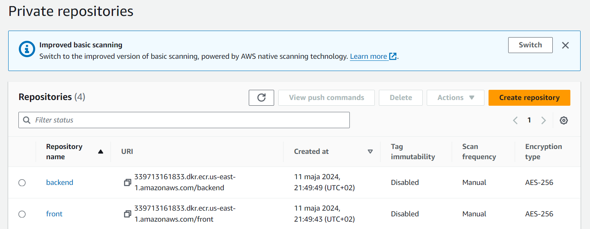
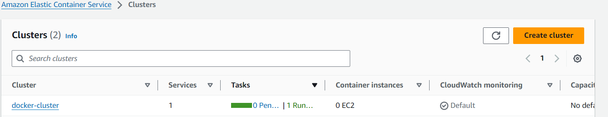
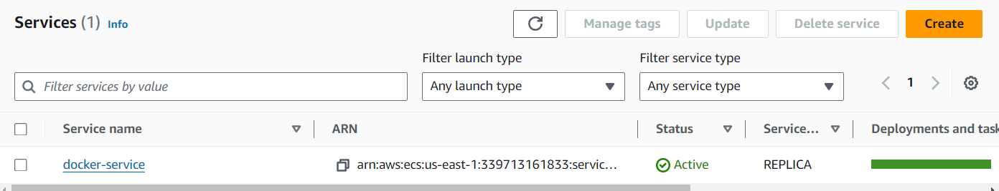
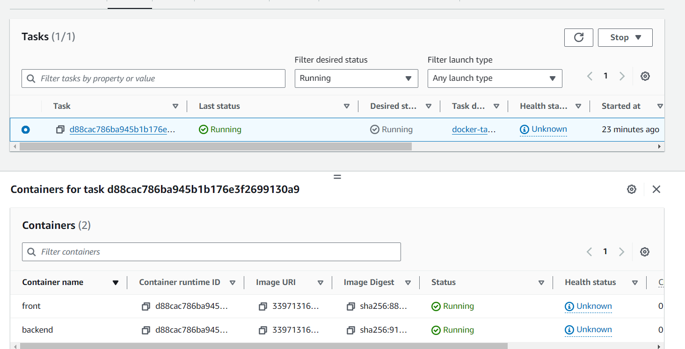
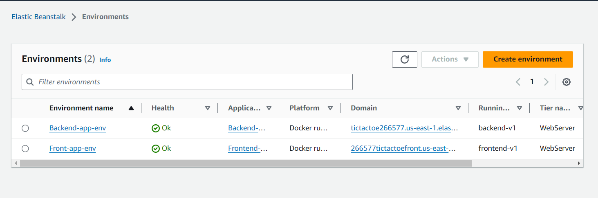

# Wiktor Tomczyk - Fargate, Beanstalk TicTacToe report

- Course: *Cloud programming*
- Group: W04IST-SI0828G
- Date: 19.05.2024

## Environment architecture

## Virtual Private Cloud (VPC):
  * Created a VPC in AWS, functioning as an isolated private network for the infrastructure.
## EC2 Instance:
  * Using Terraform, provisioned an EC2 instance in the VPC's public subnet.
  * On the EC2 instance, Docker environment was deployed, hosting containers with the game.
## Docker Containers:
  * Docker containers running on the EC2 instance hosted the game.
  * Docker containers were run by Docker Compose
## Security Groups:
  * Configured security groups in order to allow to open the address in internet browser

## Preview

Screenshots of configured AWS services. Screenshots of your application running.

## Reflections

- What did you learn?
  - I learned how to deploy app on AWS Fargate and Beanstalk.
  - I learned run docker containers without need of managing servers which simplifies devops operations.
  - I learned how to define tasks and services in ECS.
  - How to use S3 bucket which can store out data.
- What obstacles did you overcome?
    Fargate:
    - Exit code 127 while running task. Backend container could not start. The solutions was to copy code from CMD line in Dockerfile and paste it in "command" section in Dockerrun.aws.json file.
    Beanstalk:
    - "Error: solution stack name does not exist" while running terraform file. The solution was to enter the right version of Docker environment.
    - How to upload application code - I used s3 buckets. 
- What did you help most in overcoming obstacles?
  - Friends' hints
  - Internet forums
  - Documentation
- Was that something that surprised you?
  I was surprised that AWS Fargate and Elastic Beanstalk allows:
    - running containers without the need of EC2 instances what allows managing resources more effectively
    - how much it costs
